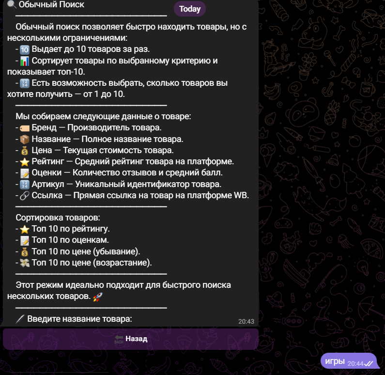
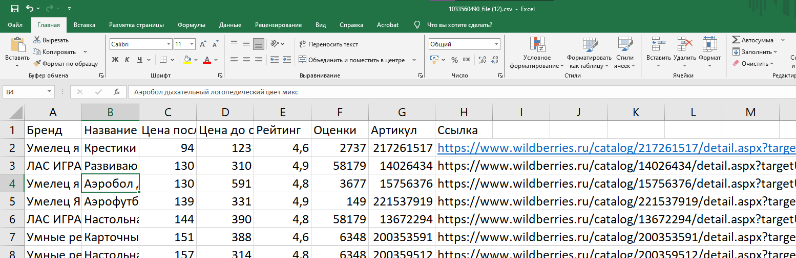

# 🛍️ Wildberries Парсер Бот

Telegram-бот для парсинга товаров с маркетплейса Wildberries. Позволяет быстро получать информацию о товарах прямо в Telegram или в формате таблицы `.csv`. Встроена админ-панель с расширенными возможностями управления.


##  🚀 Использованный стек технологий
##  🔹 Python 3 — основной язык разработки
##  🤖 Aiogram 3 — асинхронный фреймворк для создания Telegram-ботов
##  🌐 Aiohttp — для асинхронных HTTP-запросов и вебхуков
##  🗃️ SQLite3 — встроенная база данных для хранения данных
##  📁 JSON — удобный формат для хранения и обмена данными
##  🔌 API — интеграция со сторонними сервисами и источниками
##  🧪 Pytest — модульное тестирование логики бота
##  📊 Pandas — анализ и обработка табличных данных
##  🧾 CSV — импорт и экспорт данных в табличном виде
##  🌍 BeautifulSoup4 — парсинг и обработка HTML-страниц

## ⚙️ Возможности

## 🔎 Обычный поиск  
  • Поиск по ключевым словам (например: игры)  
  • Выбор сортировки: 🔽 убывание, 🔼 возрастание, ⭐ рейтинг, 💬 оценки, 🚫 без сортировки  
  • Количество товаров: от 1 до 10  
  • Результаты приходят прямо в Telegram

## 📊 Табличный поиск  
  • Функционал аналогичен обычному  
  • Выгрузка результатов в `.csv` файл (100–1000 товаров)  
  • Удобно открывается в Excel или Google Таблицах

## 🛠️ Админ-панель  
  • 📦 Экспорт всей базы данных  
  • 📁 Экспорт отдельных таблиц в `.csv`  
  • 📢 Массовая рассылка:
    - 📝 Текст  
    - 🖼️ Текст с изображением  
    - 📷 Фото  
    - 🎬 Видео  
    - 📷🎬 Видео с изображением

## 📥 Установка

1. Клонируй репозиторий:

```bash
git clone https://github.com/ibras0696/wb_aio_parser_bot.git
cd wb_aio_parser_bot
```

2. Установи зависимости:
```
pip install -r requirements.txt
```

3. Создай файл .env в корне проекта со следующим содержимым:
```
TOKEN=токен_твоего_бота
ID_ADMIN=telegram_id_админа
```

4. 🚀 Запуск
```
python main.py

В Telegram отправь боту команду /start и следуй подсказкам.
```

📦 Что возвращает бот
🏷️ Название товара
🏢 Бренд
💲 Цена до скидки
💸 Цена после скидки
💬 Количество оценок
⭐ Рейтинг
🔗 Ссылка на товар


👤 Для администратора
Доступ к админке предоставляется пользователю с telegram_id, указанным в .env.
Панель позволяет экспортировать данные и управлять рассылками.

## 📖 Пользование
▶️ Откройте бота и нажмите кнопку для начала


## 🔍 Нажмите на нужный тип поиска, затем введите название товара


## 📊 Выберите способ сортировки результатов


## 🔢 Выберите количество товаров:
— в обычном поиске: от 1 до 10
— в табличном поиске: от 100 до 1000


## 📦 Вот как выглядит выдача при стандартном поиске


## 📋 Пример отображения результатов в табличном режиме


 
 

